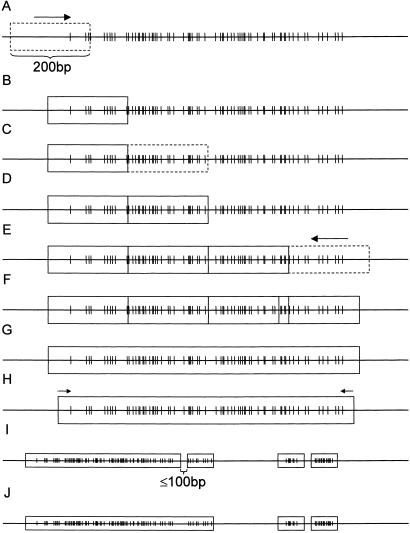

# Lab 4

**Deadline:** You need to submit (push) your task by the end of lab hours.

## CpG Islands

* Please write your code to given spaces in `answers.py`.
* Commit after each task.
* You only need to commit `answers.py`, nothing else.
* Submit (`git push`) by the end of lab session.
* You don't need to do anything to `test.py` file, it's only there for grading purposes. (However, you can manually check your answers by running `pytest test.py`)
* Your script will be checked with Python3. Make sure that your code is compatible with Python3 syntax. (If your code fails to run, you will get -2 points)
* (Your answer only contain two decimal points. i.e: 20.33, NOT 20.3276)


CpG islands are useful markers for genes in organisms containing 5-methylcytosine in their genomes. In addition, CpG islands located in the promoter regions of genes can play important roles in gene silencing during processes such as X-chromosome inactivation, imprinting, and silencing of intragenomic parasites. The generally accepted definition of what constitutes a CpG island was proposed in 1987 by Gardiner-Garden and Frommer [Gardiner-Garden, M. & Frommer, M. (1987) J. Mol. Biol. 196, 261–282] as being a 200-bp stretch of DNA with a C+G content of 50% and an observed CpG/expected CpG in excess of 0.6. Any definition of a CpG island is somewhat arbitrary, and this one, which was derived before the sequencing of mammalian genomes, will include many sequences that are not necessarily associated with controlling regions of genes but rather are associated with intragenomic parasites.

Later on Takai and Jones [Takai D, Jones PA (2002) PNAS] proposed more stringent criteria for CpG islands in humans.
Regions of DNA of greater than 500 bp with a G+C equal to or greater than 50% and observed CpG/expected CpG of 0.65 were more likely to be associated with the 5′ regions of genes

## CpG Island Criteria
* Regions of DNA of greater than 500 bp
* with a GC content equal to or greater than 0.50
* observed CpG/expected CpG of 0.65 or higher

expected CpG can be calculated using following formula
```
(C*G)/L
where:
    C=number of Cytosine
    G=number of Guanine
    L=length of sequence
```
observed CpG is number of CpG's : number of `CG`, C followed by G

### Task #1 (2pts)

* Write a function that reads a fasta file and parses it into a dictionary.

```
def fastareader(pathToFasta):
    ''A dictionary where the keys are the sequence headers (without '>' symbol) and the values are the sequences.'''
```


### Task #2 (2pts)

* Write a function returning GC content of a given DNA.

```
def getGCpercentage(inputDNA):
    '''The GC content percentage as a floating-point number.'''
```

### Task #3 (2pts)

* Write a function returning observed CpG/expected CpG of a given DNA.

```
def getobsCpGexpCpG(inputDNA):
    '''The observed CpG to expected CpG ratio (CpG O/E) as a floating-point number.'''
```

### Task #4 (4pts)

* Write a function that returns sequences that are CpG islands.
* You can use functions you have written in tasks 2 and 3

```
def getCpGislands(inputDNAs):
    '''A list of sequence headers that are potential CpG islands.'''
```


#### Optional Study Questions (*This part will not be graded*)

1. Implement algorithm below for CpG island extraction from human genome sequences by Takai and Jones


* there should be at least seven CpGs in these 200 bp windows
* (A) Set a 200-base window in the beginning of a contig, compute %GC and ObsCpG/ExpCpG. Shift the window 1 bp after evaluation until the window meets the criteria of a CpG island.
* (B) If the window meets the criteria, shift the window 200 bp and then evaluate again.
* (C and D) Repeat these 200-bp shifts until the window does not meet the criteria.
* (E) Shift the last window 1 bp toward the 5′ end until it meets the criteria.
* (G) Evaluate total %GC and ObsCpG/ExpCpG.
* (H) If this large CpG island does not meet the criteria, trim 1 bp from each side until it meets the criteria.
* (I) Two individual CpG islands were connected if they were separated by less than 100 bp.
* (J) Values for ObsCpG/ExpCpG and %GC were recalculated to remain within the criteria.

2. Find CpG Islands in [human genome chr19](https://ftp.ensembl.org/pub/release-108/fasta/homo_sapiens/dna/Homo_sapiens.GRCh38.dna.chromosome.19.fa.gz) using algorithm you have implemented.
